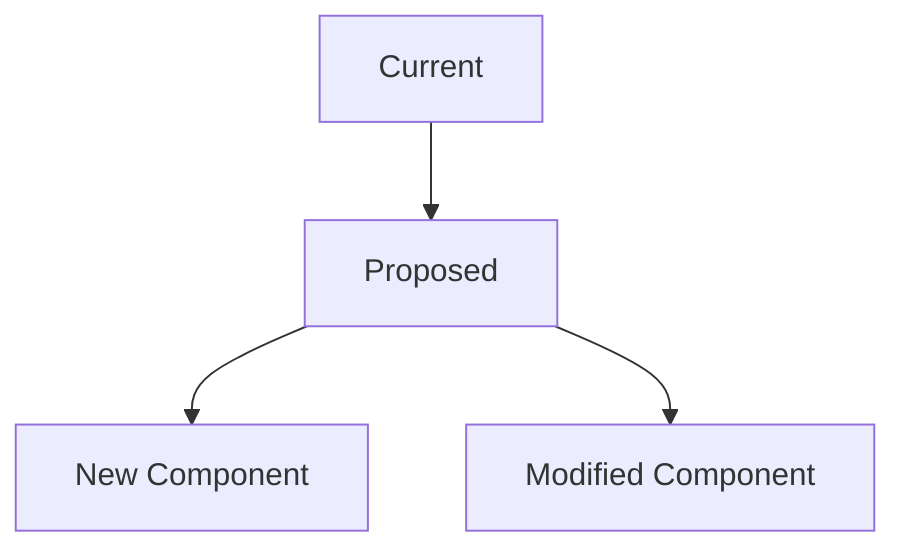

## 🚀 Feature Description

A clear and concise description of the feature you'd like to see added to the CDP.

## 🎯 CDP Component

- [ ] Event Ingestion
- [ ] Identity Resolution
- [ ] Segment Builder
- [ ] User Profiles
- [ ] Consent Tracking
- [ ] Real-time Updates
- [ ] Integration Hub
- [ ] API/Endpoints
- [ ] Performance/Optimization
- [ ] Security/Compliance
- [ ] Other (please specify)

## 💡 Use Case

Describe the specific use case this feature would enable:

### Problem Statement
What problem does this solve? What limitation does it address?

### Expected Outcome
What should users be able to do with this feature?

### Target Users
Who would benefit from this feature?
- [ ] Marketing teams
- [ ] Product managers
- [ ] Data analysts
- [ ] Developers
- [ ] Compliance officers
- [ ] Other (please specify)

## 📋 Detailed Requirements

### Functional Requirements
- [ ] Requirement 1
- [ ] Requirement 2
- [ ] Requirement 3

### Technical Requirements
- [ ] API endpoint needed
- [ ] Database schema changes
- [ ] New service/module
- [ ] Integration with external service
- [ ] Performance requirements
- [ ] Security considerations

### Non-Functional Requirements
- [ ] Performance: Response time < Xms
- [ ] Scalability: Support X users/requests
- [ ] Reliability: 99.9% uptime
- [ ] Security: GDPR compliance
- [ ] Monitoring: Metrics and alerts

## 🏗️ Proposed Implementation

### Architecture Changes


### API Design
```typescript
// Example API endpoint
POST /api/v1/cdp/new-feature
{
  "parameter": "value",
  "options": {
    "setting": true
  }
}
```

### Database Schema Changes
```sql
-- Example schema changes
ALTER TABLE cdp_events
ADD COLUMN new_feature_field JSONB;

CREATE INDEX idx_cdp_events_new_feature 
ON cdp_events USING gin(new_feature_field);
```

### Configuration Changes
```env
# New environment variables
CDP_NEW_FEATURE_ENABLED=true
CDP_NEW_FEATURE_LIMIT=1000
```

## 🔄 Integration Points

### Existing CDP Components
- [ ] Event Ingestion - How it integrates
- [ ] Segment Builder - How it affects segments
- [ ] User Profiles - How it enhances profiles
- [ ] Consent Tracking - GDPR implications

### External Integrations
- [ ] SendGrid - Email campaigns
- [ ] OneSignal - Push notifications
- [ ] Twilio - SMS messaging
- [ ] Google Analytics - Analytics tracking
- [ ] Webhooks - Custom integrations

## 📊 Success Metrics

### KPIs to Measure
- [ ] User engagement increase
- [ ] Conversion rate improvement
- [ ] Data processing speed
- [ ] System performance
- [ ] Error rate reduction

### Success Criteria
- [ ] Feature adoption rate > X%
- [ ] Performance improvement > Y%
- [ ] User satisfaction score > Z
- [ ] Zero critical bugs in first month

## 🚨 Dependencies & Risks

### Dependencies
- [ ] Prisma schema update
- [ ] Redis cache invalidation
- [ ] External API availability
- [ ] Database migration
- [ ] Other team dependencies

### Potential Risks
- [ ] Performance impact
- [ ] Data privacy concerns
- [ ] Integration complexity
- [ ] Migration risks
- [ ] Resource requirements

### Mitigation Strategies
- [ ] Performance testing
- [ ] Gradual rollout
- [ ] Backwards compatibility
- [ ] Rollback plan
- [ ] Monitoring and alerts

## 📅 Timeline & Phasing

### Phase 1: Foundation (Week 1-2)
- [ ] Core implementation
- [ ] Basic testing
- [ ] Documentation

### Phase 2: Integration (Week 3-4)
- [ ] API integration
- [ ] Testing with existing components
- [ ] Performance optimization

### Phase 3: Launch (Week 5-6)
- [ ] Production deployment
- [ ] Monitoring setup
- [ ] User training/docs

## 🧪 Testing Strategy

### Unit Tests
- [ ] Service layer tests
- [ ] Utility function tests
- [ ] API endpoint tests

### Integration Tests
- [ ] Database integration
- [ ] Redis integration
- [ ] External service integration

### Performance Tests
- [ ] Load testing
- [ ] Stress testing
- [ ] Memory usage testing

### Security Tests
- [ ] Input validation
- [ ] Authentication/authorization
- [ ] Data privacy checks

## 📚 Documentation Requirements

### Technical Documentation
- [ ] API documentation
- [ ] Architecture diagrams
- [ ] Database schema docs
- [ ] Configuration guide

### User Documentation
- [ ] User guide
- [ ] Best practices
- [ ] Troubleshooting guide
- [ ] FAQ

## 🎨 UI/UX Considerations (if applicable)

### User Interface
- [ ] New dashboard components
- [ ] Configuration screens
- [ ] Reports/analytics views
- [ ] Admin interface changes

### User Experience
- [ ] Workflow improvements
- [ ] Error handling
- [ ] Onboarding process
- [ ] Accessibility considerations

## 🔄 Alternatives Considered

### Option 1: Current Approach
**Pros:** 
- 

**Cons:** 
- 

### Option 2: Alternative Approach
**Pros:** 
- 

**Cons:** 
- 

### Option 3: Another Alternative
**Pros:** 
- 

**Cons:** 
- 

## 📷 Mockups & Designs

If applicable, add mockups, wireframes, or designs to illustrate the feature.

## ✅ Checklist

- [ ] I have checked existing issues and pull requests
- [ ] I have described the use case clearly
- [ ] I have outlined technical requirements
- [ ] I have considered security and privacy implications
- [ ] I have defined success metrics
- [ ] I have identified potential risks and mitigations
